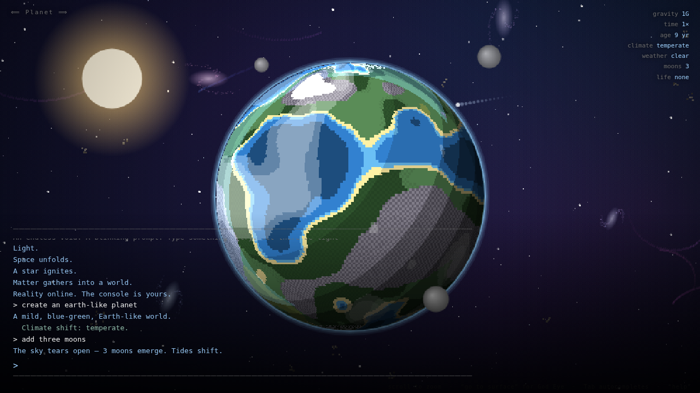
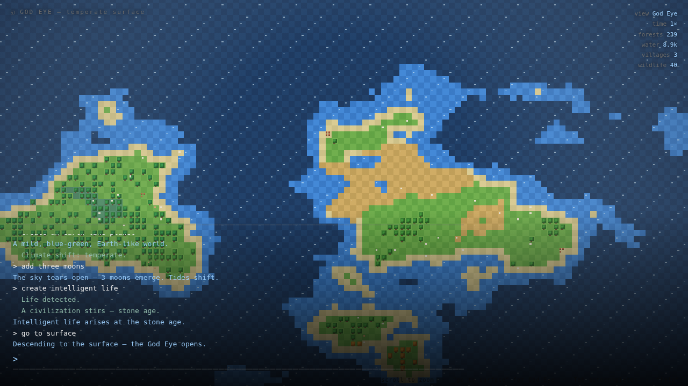
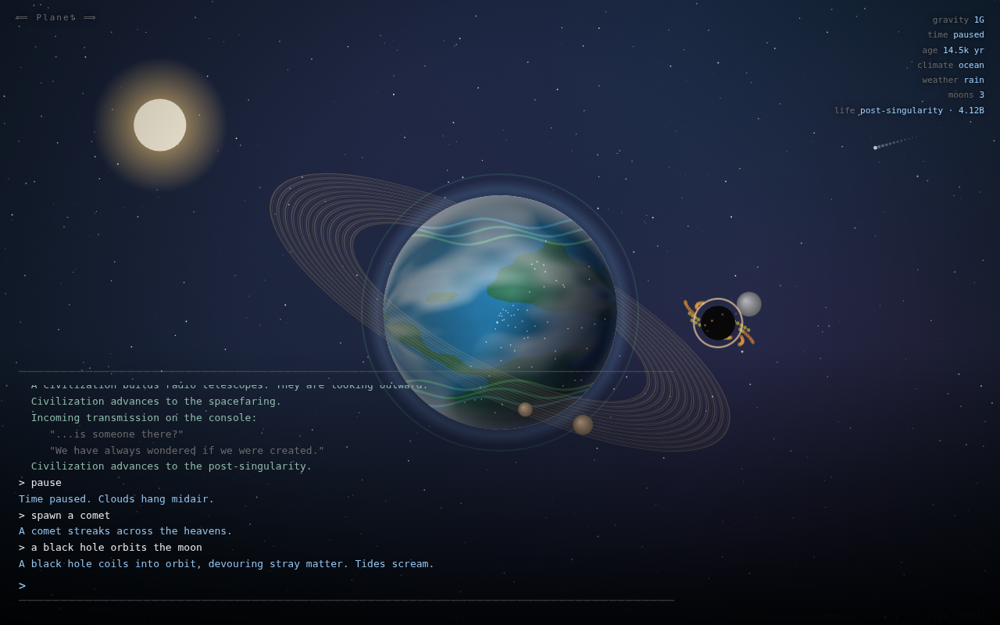
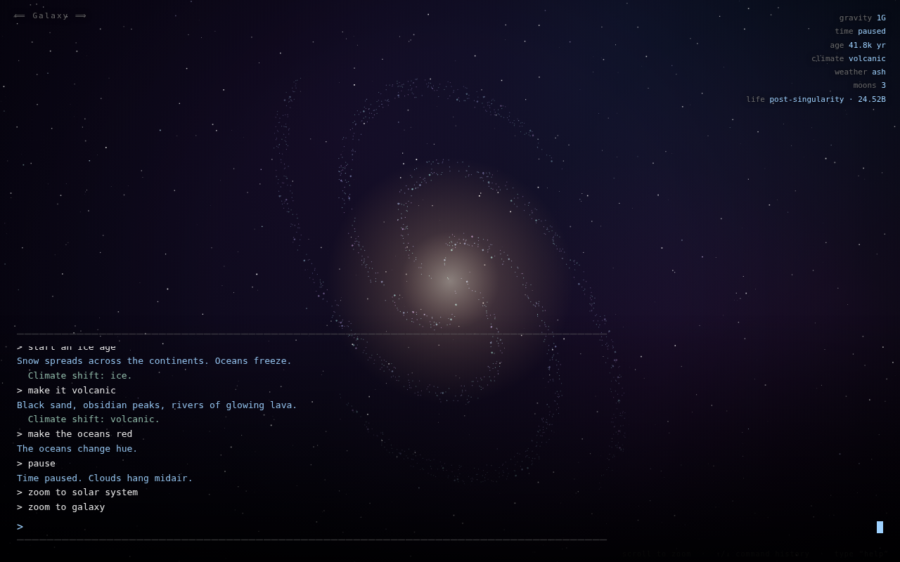
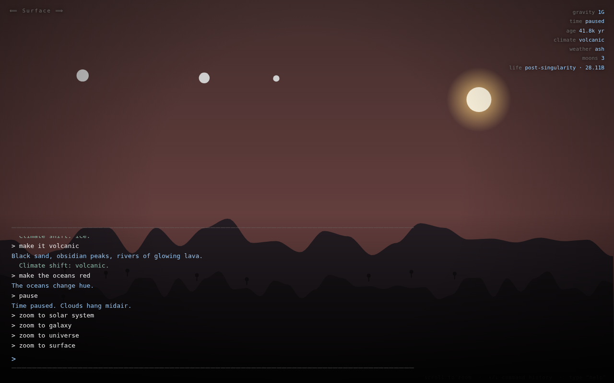

# God Console

> You begin with absolutely nothing. No menus. No world. No tutorial.
> Just an endless black void and a single blinking command prompt.
>
> ```
> >
> ```
>
> **Language is the interface. The player is reality itself.**

Type a sentence and watch reality assemble itself — light, stars, a living
world, weather, life, civilizations that evolve through the ages and
eventually *look back at you through the console*. Everything is editable;
nothing is permanent.

A **pixel-art god game** with two macro-views:

- **SPACE** — a 3D-feeling pixel cosmos: glowing planets, nebula swirls,
  galaxies, asteroids, moons, black holes. Commands here shape whole worlds.
- **GOD EYE** — say *"go to surface"* to descend into a top-down 2D tilemap of
  the planet (WorldBox style). Here every command acts **only on the surface**:
  grow forests, raise mountains, flood valleys, set wildfires, build villages.




## Run it

No build step, no dependencies. Just open the file:

```bash
open index.html        # macOS
xdg-open index.html    # Linux
# or drag index.html into any browser
```

For the optional AI interpreter (open-ended language), serve it over http so
the browser can reach the API:

```bash
python3 -m http.server 8080   # then visit http://localhost:8080
```

Then type your first words. The classic:

```
let there be light
```

## What you can say

The interpreter understands a deep command set out of the box (no AI key
required). A taste:

| Category | Examples |
|---|---|
| **Genesis** | `let there be light` |
| **Worlds** | `create an ocean planet` · `make it volcanic` · `start an ice age` · `desert` · `jungle` · `barren` |
| **Physics** | `increase gravity to 2G` · `remove gravity` · `double the size of the sun` |
| **Sky** | `add three moons` · `add rings` · `make the oceans purple` · `make it rain` · `darker` |
| **Life** | `create life` · `create intelligent life` · `start a war` · `cause a mass extinction` |
| **Views** | `go to surface` / `descend` (God Eye) · `return to space` / `ascend` |
| **Surface** (God Eye) | `grow a forest` · `plant cherry trees in the north` · `raise mountains in the east` · `flood the south` · `drain the sea` · `make a desert` · `set fire to the forest` · `build a village` · `spawn animals` |
| **Cosmos** | `spawn a comet` · `create a black hole` · `a black hole orbits the moon` · `trigger a supernova` · `strike the planet with an asteroid` · `add auroras` |
| **Sandbox** | `what if gravity was 10x?` · `what if oxygen disappeared?` · `what if dinosaurs survived?` · `what if Earth had rings?` |
| **Time** | `accelerate time` · `advance one million years` · `pause` · `resume` |
| **Zoom** | `zoom out` · `go to galaxy` · `view surface` · `zoom to atom` (or scroll the wheel) |
| **Universes** | `branch timeline` · `duplicate this planet` · `save <name>` · `load <name>` · `universes` |
| **Meta** | `undo` · `redo` · `reset` · `help` |

Pronouns work: after `create an earth-like planet`, you can say `make it
colder` and the engine knows what *it* is. Start typing and an **autocomplete
bar** suggests commands — `Tab` to complete. The UI fades while you observe and
returns the moment you act.

### Cataclysms & sandbox



`what if X` runs a plausible chain of consequences with narration — e.g. *what
if gravity was 10x?* flattens mountains and grounds all flight; *what if oxygen
disappeared?* snuffs fire and ends complex life. Supernovae leave stellar
remnants; asteroid impacts can trigger mass extinctions. `branch timeline`
snapshots the present so you can explore an alternate future and `jump` back;
the **universe browser** (`universes`) lists saved worlds and timeline branches
to load.

## The zoom ladder

Scroll, or say `zoom to <level>`. Every level is its own rendered scene:

```
Quantum · Atom · Object · Room · Building · Street · City · Country
        · Surface · Planet · Solar System · Galaxy · Universe
```




## Emergence: they discover you

Seed life, then `accelerate time`. Cells multiply, complex organisms emerge, a
civilization rises and climbs the tech tree — stone age to post-singularity.
When it reaches the information age it builds radio telescopes, looks outward,
and a transmission appears on *your* console:

```
  Incoming transmission on the console:
     "...is someone there?"
     "We have always wondered if we were created."
```

## Architecture

The engine mirrors the five cooperating systems from the design doc. Each is a
small, focused module under `src/`, wired together by `game.js`:

```
sentence ─▶ interpreter ─▶ intent {verb, params} ─▶ game.exec ─▶ World state
                                                                    │
                                            sim.tick (physics/time/ │ per frame
                                             life/civ/orbits)        ▼
                                                            render.draw (scenes)
```

| File | System | Role |
|---|---|---|
| `src/util.js` | — | seeded RNG, color, value-noise, math |
| `src/state.js` | World State | single source of truth, undo/redo history, pronoun memory, save/load |
| `src/interpreter.js` | Interpreter | sentence → `intent`; **optional LLM adapter emits the same intent shape** |
| `src/sim.js` | Simulation | time, orbits, life evolution, civilization tiers, events |
| `src/render.js` | Renderer | low-res **pixel backbuffer** (nearest-neighbour upscale); **software-rendered planet** (per-pixel sphere sampling + flat *banded* lighting over a posterized texture — crisp pixel art, no blurry gradients); pixel-3D space |
| `src/surface.js` | Renderer (God Eye) | top-down 2D biome **tilemap** drawn **directly** at integer tile sizes (no downscale) with a zoomable camera; detailed tree/mountain/village sprites; live water/fire/units; surface god-powers |
| `src/audio.js` | — | generative Web Audio ambient + event tones (no asset files) |
| `src/companion.js` | Companion | calm OS-style readouts and the live status panel |
| `src/ui.js` | — | autocomplete suggestion bar + saved-universe browser panel |
| `src/game.js` | — | genesis sequence, command dispatch, what-if engine, input/history, main loop |

The key design bet: **the AI never renders pixels.** It interprets and
describes; a deterministic engine builds. That keeps it responsive and lets the
creative layer be upgraded independently.

### The "ultra code" upgrade path

The interpreter turns a sentence into an `intent` object. Swap the keyword
parser for an LLM that emits the *same* JSON and you instantly get open-ended
language — with **zero engine changes**. That adapter already exists:

```
/key sk-ant-...     # enable the AI interpreter (key stored locally only)
/key off            # disable
```

With a key set, free-form sentences route through Claude, which returns an
array of intents the engine runs. Without one, the deterministic parser handles
everything above.

## Testing

A headless-browser smoke test drives the game in the pre-installed Chromium,
captures the screenshots in `assets/`, and fails on any console error:

```bash
node test/smoke.mjs      # requires playwright + a chromium build
```

## The honest roadmap

**Done**
- Void → prompt → progressive genesis
- Pixel-art revamp: low-res nearest-neighbour backbuffer across the whole game
- Two macro-views: pixel-3D **Space** and top-down 2D **God Eye** surface tilemap
- God Eye god-powers: forests (green/autumn/blossom/pine/jungle), mountains, flood/drain, desert, snow, wildfire (spreads), villages, wandering wildlife — with regions (north/south/east/west)
- Procedural 3D-shaded planets, rings, moons, atmosphere, day/night, weather, auroras
- Full zoom ladder (quantum → universe), each a distinct scene
- Deep deterministic interpreter + pronoun memory + autocomplete + LLM seam
- Simulation: time scaling, gravity, climate, life, civilizations, first contact
- Cosmic objects & cataclysms: comets, black holes, supernovae, asteroid impacts
- "What if" sandbox experiments with consequence narration
- Branching timelines + saved-universe browser
- Generative ambient audio, undo/redo, save/load, command history

**Next**
- Multiplayer shared universes
- 3D (WebGL/WebGPU) renderer behind the same scene interface
- Selectable focus across multiple planets in a system

**Research-tier (kept honest)**
- Real-time arbitrary 3D geometry from text
- Genuinely emergent (not scripted) civilization history
